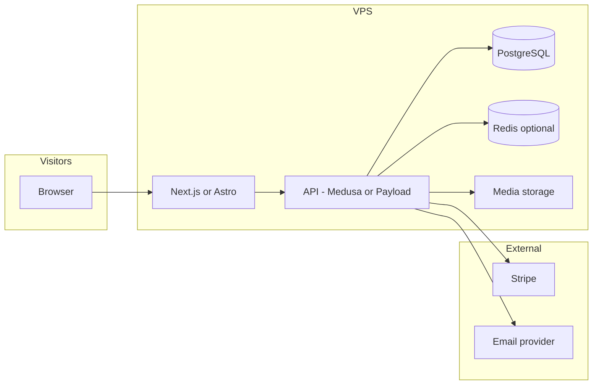

# Sodo Sidrinė — Website & E‑shop Architecture Plan

This document records **architectural decisions** for a Lithuanian cider brand website ([Instagram reference](https://www.instagram.com/sodo_cider/)): marketing pages (including **About us**), a **cider catalogue**, and **e‑shop** focused on **boxes of ciders**, deployable on a **VPS**, with a **simple way for non‑technical staff to change product text and images**.

---

## 1. Goals & constraints

| Goal | Implication |
|------|-------------|
| About, catalogue, shop | Separate content types: static pages, product listings, cart/checkout |
| Boxes as sellable units | Product model supports “bundle” or “box SKU” with contained variants, stock, and price |
| VPS hosting | Prefer self‑hosted or Docker‑friendly components; avoid mandatory SaaS lock‑in for core data |
| Non‑technical edits | Dedicated **admin UI** (CMS or commerce admin), not Git or code deploys for routine changes |

---

## 2. Recommended stack (balanced: modern + maintainable)

### 2.1 Frontend

- **Framework:** **Next.js** (React) *or* **Astro** with React islands.
  - **Next.js** if you want one codebase for marketing + shop UI with SSR/ISR for SEO and fast loads.
  - **Astro** if the site is mostly static content with a smaller interactive shop “island”.
- **Styling:** Tailwind CSS or CSS modules — match the warm, orchard‑led aesthetic suggested by the brand’s social presence.
- **i18n:** Lithuanian primary; structure for English later (URL prefix `/en` or subdomain) if needed.

**Decision to lock:** Pick **Next.js + Tailwind** unless the team strongly prefers minimal JS on marketing pages (then Astro).

### 2.2 Backend & commerce logic

Two viable patterns:

| Pattern | Pros | Cons |
|---------|------|------|
| **A. Headless CMS + custom cart/checkout** | Full control; CMS is familiar for editors | You implement cart, payments, emails |
| **B. Commerce engine + storefront** | Orders, inventory, discounts built‑in | Heavier; steeper ops learning curve |

**Recommendation for a small cider brand on VPS:** **Pattern B** using **Medusa.js** (Node, PostgreSQL, self‑hosted) *or* **Pattern A** using **Payload CMS** (TypeScript, MongoDB or Postgres) + **Stripe Checkout** for payments and simple “box” products.

- **Medusa** fits if you expect real inventory, promotions, and order management in one admin.
- **Payload + Stripe** fits if the catalogue is simple and “boxes” are few SKUs with mostly editorial content.

**Decision to lock:** Choose **Medusa** if order/inventory complexity grows early; choose **Payload + Stripe Checkout** for a slimmer first version with strong editorial control.

### 2.3 Database

- **PostgreSQL** (single instance on VPS; same DB for commerce or CMS depending on stack).
- **Redis** (optional but useful): sessions, cart cache, Medusa jobs — co‑hosted in Docker.

### 2.4 Non‑technical content editing (products, images, About text)

Requirement: **edit pictures and text without touching code or Git.**

| Approach | Fit |
|----------|-----|
| **Built‑in admin of CMS/commerce** (Payload, Medusa Admin, Strapi) | **Best fit** — upload images, WYSIWYG or rich text for About, structured fields for cider descriptions |
| **Decap CMS / Git‑based** | Poor fit for “non‑technical” unless someone accepts occasional Git concepts |
| **WordPress + WooCommerce** | Strong fit if the team already knows WordPress; single VPS LAMP/PHP stack |

**Recommendation:** Use the **admin UI of whichever product system you choose** (Payload or Medusa). Define clear **content models**:

- **Product (cider):** name, slug, short description, long description, ABV, volume, tasting notes, **gallery**, featured image, availability flag.
- **Box product:** references N ciders or fixed composition; price; stock; shipping weight class.
- **Page:** About us — rich text + optional image blocks.

Train staff on **one URL** (e.g. `https://admin.sodosidrine.lt`) and document **image guidelines** (min resolution, aspect ratio) to keep the storefront consistent with [Instagram](https://www.instagram.com/sodo_cider/) visuals.

### 2.5 Payments & compliance (Lithuania / EU)

- **Stripe** (or **Paysera** / local acquirer if you need strict local rails) — EUR, cards, wallets as supported.
- **GDPR:** privacy policy, cookie consent if analytics, data processing agreement with payment provider.
- **Invoicing:** align with Lithuanian rules (VAT, company details on receipts); many teams use Stripe’s invoice/receipt features plus accountant‑approved wording.

**Decision to lock:** Start with **Stripe** unless a specific bank/package is mandatory; add invoicing details per accountant advice.

### 2.6 Email & notifications

- **Transactional:** Resend, Postmark, or SMTP from VPS (Dockerized) for order confirmation, shipping updates.
- **Marketing:** optional later (e.g. newsletter) — keep out of scope for v1 unless required.

### 2.7 Media (images)

- **Object storage on VPS:** local disk with backups *or* **S3‑compatible** bucket (Hetzner, Wasabi, self‑hosted MinIO on same VPS).
- **Image optimization:** Next.js `Image` component + CDN in front (optional: Cloudflare in front of VPS for cache and TLS).

---

## 3. High‑level system diagram

---

## 4. Deployment on VPS

- **OS:** Ubuntu LTS.
- **Orchestration:** **Docker Compose** — services: `web` (frontend), `api` (backend), `db`, `redis` (if used), reverse proxy.
- **Reverse proxy + TLS:** **Caddy** or **Traefik** — automatic Let’s Encrypt certificates.
- **Backups:** nightly DB dump + media folder (or bucket versioning) to off‑VPS storage.
- **CI/CD (optional):** GitHub Actions builds images and SSH deploys, or pull on tag — **not** required for day‑to‑day product edits (those go through admin UI).

---

## 5. Information architecture (site map)

- **Home** — hero, featured boxes, link to catalogue, trust (local, orchard, etc.).
- **About us** — story, team, orchard, values (editable in CMS).
- **Products / Ciders** — filterable catalogue (by style, sweetness, seasonality if applicable).
- **Shop** — box products, product detail, add to cart.
- **Cart & checkout** — Stripe Checkout or embedded flow.
- **Legal** — privacy, terms, shipping & returns (LT).

---

## 6. Security checklist (short)

- HTTPS everywhere; HSTS via proxy.
- Admin behind strong passwords + **2FA** if the platform supports it.
- Rate limiting on auth and checkout endpoints.
- Secrets in env files / Docker secrets, not in Git.
- Regular dependency and image updates.

---

## 7. Alternative stacks (if priorities shift)

| If you need… | Consider… |
|----------------|-----------|
| Fastest “someone can click around WordPress” | **WordPress + WooCommerce** on VPS |
| Maximum flexibility, Laravel team | **Laravel + Filament** + custom shop or **Lunar** |
| Fully managed commerce, less VPS ops | **Shopify** storefront + headless front (trade‑off: not fully on VPS) |

---

## 8. Suggested implementation phases

1. **Foundation:** VPS, Docker Compose, domain, TLS, PostgreSQL, chosen backend + admin.
2. **Content model:** Ciders, boxes, About page fields; seed data; image workflow documented.
3. **Storefront:** Home, About, catalogue, product pages, cart, Stripe test mode.
4. **Hardening:** backups, monitoring, production Stripe, legal pages, SEO meta, analytics (if any).
5. **Iterate:** shipping integrations, promotions, second language.

---

## 9. Open decisions (fill in before build)

- [Next] **Frontend:** Next.js vs Astro.
- [Payload + Stripe] **Commerce core:** Medusa vs Payload + Stripe Checkout vs WooCommerce.
- [Stripe] **Payment provider:** Stripe vs local PSP.
- [Local disk] **Media:** local disk vs S3‑compatible bucket.
- [LT only for the first version] **Languages:** LT only vs LT + EN at launch.

---

*This plan is intentionally implementation‑agnostic at the detail level so you can swap Medusa/Payload/WooCommerce without redoing UX or hosting assumptions.*
